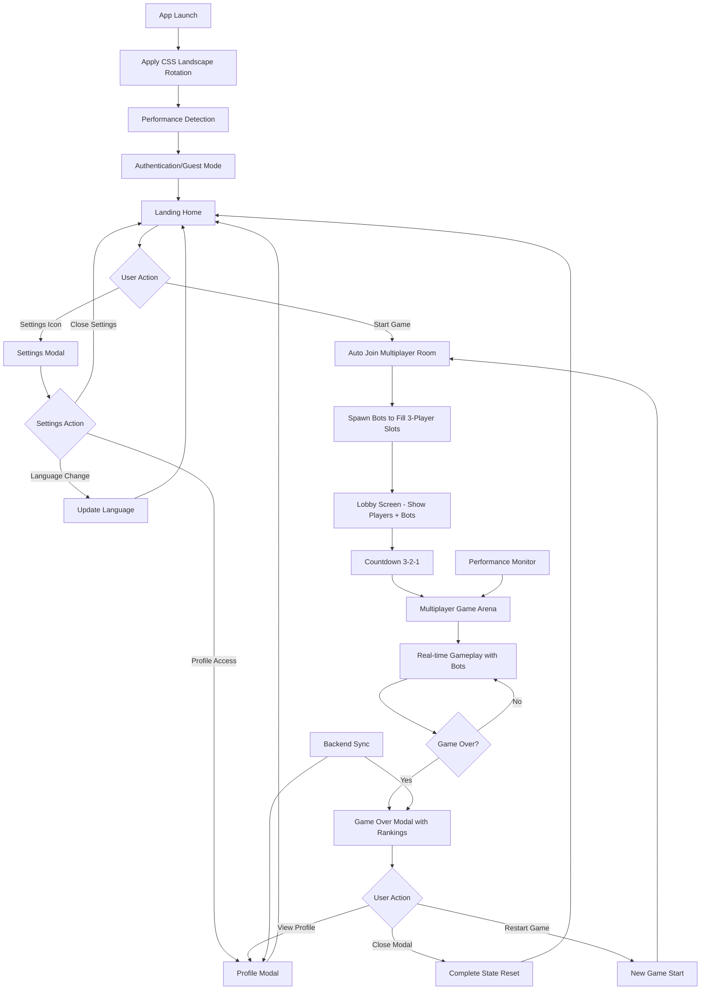

# Snake Zone - Product Requirements Document

## 1. Product Overview

Snake Zone is a real-time multiplayer snake-style game designed for mobile devices with a visually rotated landscape interface. Players hold their devices in portrait orientation while the game interface is rotated 90 degrees via CSS transforms to provide an optimal landscape gaming experience. The game operates exclusively in multiplayer mode where players automatically join shared rooms, with intelligent AI bots filling empty slots to maintain engaging 3-player gameplay at all times.

The game targets mobile users seeking quick, competitive multiplayer experiences with seamless auto-matchmaking and consistent gameplay quality through bot-assisted room management, without requiring native screen rotation APIs.

## 2. Core Features

### 2.1 User Roles

| Role   | Registration Method | Core Permissions                        |
| ------ | ------------------- | --------------------------------------- |
| Player | MOS SDK integration | Can join rooms, play games, view scores |
| Guest  | Auto-generated ID   | Limited gameplay, no score persistence  |

### 2.2 Feature Module

Our Snake Zone game consists of the following main pages:

1. **Game Arena**: main game canvas, real-time multiplayer gameplay with bots, enhanced point system with different food values, floating score animations, directional snake head indicators, score display, joypad controls
2. **Room Lobby**: auto room joining, countdown display (3,2,1), player list with bot indicators
3. **Game Over Modal**: score summary with multiplayer rankings, highest score display, global leaderboard, restart functionality
4. **Landing Home**: main entry point with settings icon, language selection, game start
5. **Settings Modal**: display settings, sound controls, language selection, user profile access

### 2.3 Advanced Performance Monitoring System

**Client-Side Performance Management**:
- Device tier detection (low/medium/high) based on memory and CPU cores
- Thermal throttling with automatic FPS reduction when device overheats
- Battery optimization that reduces performance when battery is low and not charging
- Adaptive frame rate scaling (8-30 FPS) based on device capabilities
- Canvas scaling optimization (0.5x to 1.0x) for performance
- Frame time history tracking for performance analysis
- Thermal state monitoring (normal/warm/hot/critical) with automatic adjustments

**Server-Side Performance Metrics**:
- Real-time performance logging with 30-second interval reports
- Memory usage monitoring with 150MB warning and 200MB critical thresholds
- Bot performance tracking (updates per minute, maintenance cycles)
- Player activity metrics (connections, disconnections, peak player counts)
- Game activity analytics (food eaten, dead points created/cleaned)
- Server state management with automatic pause/resume based on player activity
- Comprehensive uptime and response time tracking

### 2.4 User Profile & Backend Integration System

**Profile Management**:
- ProfileModal component with user avatar display and game statistics
- MOS SDK integration for user authentication and profile data
- Backend user profile storage and retrieval system
- Personal best score tracking with persistent storage
- User ranking system with real-time backend synchronization
- Score update tracking with old/new score comparison analytics

**Authentication Features**:
- MOS SDK login integration with secure token-based authentication
- Guest user support with auto-generated unique identifiers
- User information retrieval and backend storage synchronization
- Language detection from MOS SDK for automatic localization
- Device capabilities and window information detection

### 2.5 Global Leaderboard & Analytics System

**Core Requirements**:
- Track top 10 global high scores across all players (excluding bot scores)
- Automatically save new personal records when user achieves higher score than previous best
- Display current user's position in global leaderboard if score qualifies for top 10
- Persistent storage of global records with player identification
- Real-time updates when new records are achieved
- Comprehensive game statistics broadcasting and session management

**Display Logic**:
- Show global leaderboard in Game Over modal alongside personal stats
- Highlight current user's entry with distinct visual styling if in top 10
- Display rank, player name, and score for each leaderboard entry
- Crown icons or special indicators for top 3 positions
- Smooth animations when leaderboard updates with new records
- Real-time player activity tracking and analytics collection

### 2.6 Enhanced Point System & Visual Features

**Point System Enhancement:**
- **Pizza & Apple**: 1 point each (standard food items)
- **Cherry, Donut & Burger**: 2 points each (premium food items)
- **Visual Feedback**: Floating score animations (+1 or +2) appear when eating food
- **Performance Optimized**: Animations are lightweight and don't affect gameplay performance

**Snake Visual Enhancements:**
- **Direction Indicators**: Snake heads display directional arrows showing movement direction
- **Score Animations**: Floating text shows point values when food is consumed
- **Synchronized Rendering**: All visual enhancements work seamlessly in multiplayer mode

### 2.7 Page Details

| Page Name       | Module Name      | Feature Description                                                        |
| --------------- | ---------------- | -------------------------------------------------------------------------- |
| Landing Home    | Settings Icon    | Right-side settings gear icon that opens settings modal                    |
| Landing Home    | Game Start       | Main entry point with play button and game branding                        |
| Landing Home    | Language Display | Current language flag indicator in top area                                |
| Game Arena      | Game Canvas      | Render worm movement with directional indicators, enhanced food collection with different point values, collision detection, real-time sync |
| Game Arena      | Point System     | Different food types award different points: Pizza/Apple (1pt), Cherry/Donut/Burger (2pts) |
| Game Arena      | Visual Effects   | Floating score animations (+1/+2), directional snake head indicators, performance-optimized rendering |
| Game Arena      | Joypad Controls  | Touch-based directional controls optimized for rotated landscape interface |
| Game Arena      | Score Display    | Real-time score updates with enhanced visual feedback, leaderboard during gameplay |
| Room Lobby      | Auto Matchmaking | Connect players to available rooms, automatically spawn bots to maintain 3-player gameplay |
| Room Lobby      | Countdown Timer  | Display 3-2-1 countdown before game starts                                 |
| Room Lobby      | Player Status    | Show connected players, intelligent bot indicators, connection status      |
| Game Over Modal | Score Summary    | Display current score, highest score, session statistics                   |
| Game Over Modal | Global Leaderboard | Show top 10 global records (excluding bots), highlight current user position if in top 10 |
| Game Over Modal | Modal Close      | Close modal and reset all game state (equivalent to SPA hard reload)       |
| Game Over Modal | Restart Controls | Start new game without page reload, rejoin room with zero score            |
| Game Over Modal | Scrollable Content | Enable vertical scrolling for modal content in landscape mode              |
| Settings Modal  | Language Tab     | Flag-based language selection (EN, KH, CN) with react-i18next integration  |
| Settings Modal  | Display Settings | Visual rotation controls, interface preferences                            |
| Settings Modal  | Sound Controls   | Audio settings and volume controls                                         |
| Settings Modal  | User Profile     | MOS SDK integration for user info, login status, ProfileModal with statistics |
| Settings Modal  | Scrollable Content | Enable vertical scrolling for modal content in landscape mode              |
| Profile Modal   | User Statistics  | Display user avatar, best score, global ranking, backend data synchronization |
| Profile Modal   | Performance Stats | Real-time performance metrics, device optimization status, thermal monitoring |

## 3. Core Process

**Main Game Flow:**

1. User opens app → Game interface visually rotated to landscape mode (CSS transform)
2. System initializes performance monitoring and detects device capabilities
3. User authentication occurs automatically via MOS SDK or guest mode
4. Landing home displays with settings icon and current language
5. User can access settings modal for language/preferences or start game
6. System auto-connects to multiplayer room and spawns bots to ensure 3-player gameplay
7. Game engine adapts performance settings based on device tier and thermal state
8. Display lobby with player count (human + bot indicators) and 3-2-1 countdown
9. Game starts with synchronized multiplayer gameplay (human players + AI bots)
10. User collects food to grow their snake and increase score:
    - **Pizza & Apple**: Award 1 point with +1 floating animation
    - **Cherry, Donut & Burger**: Award 2 points with +2 floating animation
    - **Visual Feedback**: Snake head shows directional indicator for movement
11. On death → Show game over modal with scores, rankings, and global leaderboard
12. System updates backend with new score and analytics data
13. Modal Close → Complete state reset (equivalent to app restart)
14. Restart → New game with zero score, rejoin multiplayer room with fresh bot spawning

**Enhanced Gameplay Features:**
- **Point System**: Different food types provide varying point values for strategic gameplay
- **Visual Feedback**: Floating score animations and directional indicators enhance user experience
- **Performance Optimized**: All visual enhancements maintain optimal fps gameplay

**Performance Optimization Flow:**

1. System continuously monitors device performance, battery, and thermal state
2. Frame rate automatically adjusts (8-30 FPS) based on device capabilities
3. Canvas scaling and shadow effects optimize based on performance tier
4. Server tracks performance metrics and adjusts bot behavior accordingly
5. System pauses/resumes server operations based on player activity levels

**User Profile & Authentication Flow:**

1. System attempts MOS SDK authentication on app launch
2. If MOS SDK unavailable, creates guest user with auto-generated ID
3. User profile data syncs with backend including scores and statistics
4. ProfileModal displays user avatar, best score, global ranking, and performance stats
5. Language preference detected from MOS SDK or user selection
6. All user data persists across sessions with backend synchronization

**Settings Flow:**

1. User accesses Settings modal from Game Over screen or during gameplay pause
2. User can adjust language (English/Khmer/Chinese), sound settings, and display preferences
3. User can view detailed profile information and performance statistics
4. Settings are automatically saved and applied immediately with backend sync

**Multiplayer & Analytics Flow:**

1. System automatically matches players into rooms (up to 3 human players)
2. If fewer than 3 human players, system adds AI bots to fill the room
3. All players see the same game state with real-time synchronization
4. Server broadcasts comprehensive game statistics and player activity metrics
5. When a player dies, they can restart and rejoin while others continue playing
6. Leaderboard updates in real-time showing all players' current scores
7. System tracks session analytics, score comparisons, and global ranking updates



## 4. User Interface Design

### 4.1 Design Style

* **Primary Colors**: Vibrant green (#00FF88) for worms, dark blue (#1a1a2e) for background

* **Secondary Colors**: Orange (#FF6B35) for food, red (#FF0000) for danger/collision

* **Performance Colors**: Blue (#2196F3) for optimal, Orange (#FF9800) for warning, Red (#F44336) for critical states

* **Score Animation Colors**: Bright yellow (#FFD60A) for +1 points, gold (#FF9F0A) for +2 points

* **Button Style**: Rounded corners with 8px radius, gradient backgrounds

* **Font**: Roboto Bold for scores, Roboto Regular for UI text (16px-24px), Roboto Mono for performance metrics (14px), Bold sans-serif for floating score animations (18px)

* **Layout Style**: Full-screen landscape with floating UI elements, adaptive canvas scaling

* **Icons**: Minimalist line icons, gaming-themed emojis (🐍, 🎮, 🏆), performance indicators (🔥, ⚡, 🔋)

* **Direction Indicators**: Triangular arrows with 3px stroke, semi-transparent overlay

* **Visual Effects**: Performance-optimized canvas animations with alpha blending, floating scores with 1.5s fade-out

* **Performance Indicators**: Color-coded badges for device tier, thermal state icons, battery optimization visual feedback

### 4.2 Page Design Overview

| Page Name       | Module Name      | UI Elements                                                                |
|-----------------|------------------|----------------------------------------------------------------------------|
| Landing Home    | Main Interface   | Game title, start button, settings icon, language indicator, performance badge |
| Game Arena      | Game Canvas      | Snake sprites with directional indicators, enhanced food items with different point values, floating score animations, touch control overlay, adaptive scaling |
| Game Arena      | UI Overlay       | Current score with visual feedback, pause button, mini-map, FPS indicator, thermal status |
| Game Arena      | Performance HUD  | Device tier badge, battery status, frame rate display, thermal warning    |
| Game Arena      | Visual Effects   | **Floating +1/+2 score animations (yellow/gold), directional snake head arrows (semi-transparent triangles), performance-optimized canvas rendering** |
| Game Arena      | Point System UI  | **Visual differentiation for food types: Pizza/Apple (standard glow), Cherry/Donut/Burger (premium glow effect)** |
| Game Over Modal | Score Display    | Current score, best score, ranking position, restart button, score comparison |
| Game Over Modal | Leaderboard      | Top 10 global scores, player highlighting, crown icons for top 3, real-time updates |
| Game Over Modal | Analytics        | Session statistics, performance metrics, backend sync status              |
| Settings Modal  | Language Section | Language selection buttons (EN/KH/CN), current selection highlight        |
| Settings Modal  | Sound Controls   | Volume sliders, mute toggles, sound effect previews                       |
| Settings Modal  | User Profile     | User avatar, name, login status, MOS SDK integration indicators           |
| Settings Modal  | Performance      | Device optimization settings, thermal monitoring toggle, FPS limit controls |
| Profile Modal   | User Info        | Avatar display, username, authentication status, guest/MOS SDK indicator  |
| Profile Modal   | Statistics       | Best score, global ranking, games played, session analytics               |
| Profile Modal   | Performance      | Device tier, current FPS, thermal state, battery optimization status      |
| Profile Modal   | Backend Sync     | Sync status indicator, last update timestamp, connection quality          |

### 4.3 Responsiveness

**Portrait-Held Landscape Design**: The entire application is designed for users holding their devices in portrait orientation while the game interface is visually rotated 90 degrees using CSS transforms. This approach provides an optimal landscape gaming experience without relying on native screen orientation APIs, making it compatible with mini-app environments that may restrict device orientation controls.

**Modal Scrollability**: All modals (Game Over, Settings) are designed with scrollable content areas to handle varying content heights in landscape mode. Modal containers have maximum height constraints with overflow-y: auto to ensure content accessibility on smaller screens or when additional features like global leaderboards extend content length.

## 5. Technical Architecture

### 5.1 Technology Stack

* **Frontend**: React 18 + TypeScript + Vite

* **State Management**: Zustand for multiplayer game state and enhanced scoring system

* **Internationalization**: react-i18next for multi-language support

* **Real-time Communication**: Socket.io client for multiplayer and bot communication with synchronized point updates

* **Mobile Integration**: MOS SDK for mini-program features

* **Performance Monitoring**: Client-side PerformanceManager with device tier detection

* **Authentication**: MOS SDK integration with guest user fallback

* **Backend Integration**: AuthService for user profile and score synchronization

* **Backend**: Node.js + Express + Socket.io server with intelligent bot management and enhanced point system validation

* **Analytics**: Real-time game statistics broadcasting and player activity tracking

* **User Management**: Backend user profile storage and global leaderboard system

* **Visual Effects Engine**: Performance-optimized animations for score feedback and directional indicators

### 5.2 Development Flow

#### 5.2.1 Environment Setup

```bash
# Development command (watches both client and server)
npm run dev

# Port management (if needed)
npx kill-port 3000 5000
```

#### 5.2.2 Code Organization Principles

**DRY Implementation:**

* Shared types between client/server in `/shared/types`

* Reusable game logic in `/shared/game-engine`

* Common utilities in `/shared/utils`

* Socket event definitions in `/shared/events`

**File Structure:**

```
/client
  /public
    /locales       # i18n translation files
      /en          # English translations
        common.json
        game.json
      /kh          # Khmer translations
        common.json
        game.json
      /cn          # Chinese translations
        common.json
        game.json
  /src
    /components     # Reusable UI components
      /modals       # Modal components (Settings, GameOver)
      /ui           # Basic UI components
    /game          # Game-specific logic
    /hooks         # Custom React hooks
    /stores        # Zustand stores
    /services      # API and socket services
    /utils         # Client utilities
    /i18n          # Internationalization setup
/server
  /src
    /controllers   # Route handlers
    /services      # Business logic
    /socket        # Socket.io handlers
    /utils         # Server utilities
/shared           # Common code between client/server
  /types          # TypeScript definitions
  /game-engine    # Core game logic
  /events         # Socket event definitions
  /utils          # Shared utilities
```

#### 5.2.3 Development Guidelines

1. **Orientation Enforcement**: Implement CSS and JavaScript locks for landscape mode
2. **Socket Synchronization**: Use Zustand middleware for socket state sync with enhanced scoring system
3. **Game State Management**: Centralized game state with predictable updates and point value validation
4. **Internationalization**: react-i18next setup with JSON translation files
5. **Error Handling**: Graceful degradation for connection issues
6. **Performance**: 60fps gameplay with optimized rendering and lightweight visual effects
7. **Visual Effects**: Performance-optimized animations that don't impact game logic or network sync
8. **Point System**: Server-side validation with client-side visual feedback for different food values

#### 5.2.4 Testing Strategy

* **Unit Tests**: Game logic, utilities, and pure functions

* **Integration Tests**: Socket communication and state synchronization

* **Mobile Testing**: Landscape orientation and touch controls

* **Multiplayer Testing**: Room management and real-time sync

### 5.3 Internationalization Setup

#### 5.3.1 Language Support

* **Supported Languages**: English (EN), Khmer (KH), Chinese (CN)

* **Default Language**: English (EN)

* **Language Detection**: Browser language detection with fallback to default

* **Persistence**: Selected language stored in localStorage

#### 5.3.2 Translation Structure

**Translation Files Location**: `/client/public/locales/{language}/`

**File Organization**:

```
/locales
  /en
    common.json     # Common UI elements, buttons, labels
    game.json       # Game-specific terms, scores, messages
  /kh
    common.json     # Khmer translations
    game.json       # Khmer game terms
  /cn
    common.json     # Chinese translations
    game.json       # Chinese game terms
```

**Translation Keys Structure**:

```json
// common.json
{
  "settings": {
    "title": "Settings",
    "language": "Language",
    "sound": "Sound",
    "close": "Close"
  },
  "buttons": {
    "play": "Play",
    "restart": "Restart",
    "close": "Close"
  }
}

// game.json
{
  "score": {
    "current": "Score",
    "highest": "Best Score",
    "rank": "Rank"
  },
  "game": {
    "gameOver": "Game Over",
    "countdown": "Get Ready",
    "waiting": "Waiting for players..."
  }
}
```

#### 5.3.3 Implementation Details

**React-i18next Configuration**:

```typescript
// i18n/index.ts
import i18n from 'i18next';
import { initReactI18next } from 'react-i18next';
import Backend from 'i18next-http-backend';
import LanguageDetector from 'i18next-browser-languagedetector';

i18n
  .use(Backend)
  .use(LanguageDetector)
  .use(initReactI18next)
  .init({
    fallbackLng: 'en',
    supportedLngs: ['en', 'kh', 'cn'],
    defaultNS: 'common',
    ns: ['common', 'game'],
    backend: {
      loadPath: '/locales/{{lng}}/{{ns}}.json'
    },
    detection: {
      order: ['localStorage', 'navigator'],
      caches: ['localStorage']
    }
  });
```

**Language Switching Component**:

```typescript
// components/LanguageSelector.tsx
const LanguageSelector = () => {
  const { i18n } = useTranslation();
  
  const languages = [
    { code: 'en', flag: '🇺🇸', name: 'English' },
    { code: 'kh', flag: '🇰🇭', name: 'ខ្មែរ' },
    { code: 'cn', flag: '🇨🇳', name: '中文' }
  ];
  
  const changeLanguage = (lng: string) => {
    i18n.changeLanguage(lng);
  };
};
```

### 5.4 Deployment

* **Development**: Local development with hot reload and i18n hot reloading

* **Production**: Optimized builds with environment-specific configs and pre-loaded translations

* **Mobile**: MOS SDK integration for mini-program deployment with language detection

## 6. API Documentation

### 6.1 Socket Events

#### Client to Server Events

| Event Name              | Parameters                                                                 | Description                                                 |
| ----------------------- | -------------------------------------------------------------------------- | ----------------------------------------------------------- |
| `playerMove`            | `{ playerId: string, angle: number, x: number, y: number, points: Array }` | Updates player position and movement data                   |
| `foodEaten`             | `{ playerId: string, foodId: number }`                                     | Notifies server when player consumes food                   |
| `deadPointEaten`        | `{ playerId: string, deadPoints: Array }`                                  | Notifies server when player consumes dead points            |
| `playerDied`            | `{ playerId: string, deadPoints: Array }`                                  | Notifies server when player dies and provides body points   |
| `requestMinimumPlayers` | `{ minPlayers: number }`                                                   | Requests server to spawn bots to reach minimum player count |
| `performanceMetrics`    | `{ playerId: string, fps: number, deviceTier: string, thermalState: string, batteryLevel?: number }` | Client performance data for server optimization |

#### Server to Client Events

| Event Name           | Data Structure                                                             | Description                                       |
| -------------------- | -------------------------------------------------------------------------- | ------------------------------------------------- |
| `gameInit`           | `{ playerId: string, gameState: GameState }`                               | Initial game state sent to new player             |
| `playerJoined`       | `Player`                                                                   | Broadcasts new player joining to existing players |
| `playerMoved`        | `{ playerId: string, x: number, y: number, angle: number, points: Array }` | Broadcasts player movement to other players       |
| `playerDied`         | `{ playerId: string, deadPoints: Array }`                                  | Broadcasts player death and resulting dead points |
| `playerRespawned`    | `Player`                                                                   | Broadcasts player respawn after death             |
| `playerDisconnected` | `string`                                                                   | Broadcasts player ID when they disconnect         |
| `playerLeft`         | `{ playerId: string }`                                                     | Broadcasts when player leaves the game            |
| `foodRegenerated`    | `Food`                                                                     | Broadcasts food regeneration after consumption    |
| `deadPointsRemoved`  | `{ deadPoints: Array }`                                                    | Broadcasts removal of consumed dead points        |
| `scoreUpdate`        | `{ playerId: string, score: number }`                                      | Broadcasts score updates                          |
| `leaderboardUpdate`  | `{ leaderboard: Array }`                                                   | Broadcasts updated leaderboard                    |
| `gameStats`          | `{ playerCount: number, foodCount: number, leaderboard?: Array }`          | Periodic game statistics                          |
| `serverMetrics`      | `{ uptime: number, memoryUsage: number, playerCount: number, botPerformance: object, gameActivity: object }` | Server performance and analytics data |

### 6.2 Authentication API

#### AuthService Interface

```typescript
interface AuthService {
  // MOS SDK Authentication
  login(): Promise<LoginResponse>
  getUserInfo(): Promise<UserInfo | null>
  saveUserInfo(userInfo: UserInfo): void
  
  // Score Management
  getPlayerScore(): Promise<number>
  updatePlayerScore(score: number): Promise<void>
  
  // Ranking System
  getGameRank(): Promise<RankData[]>
}

interface LoginResponse {
  success: boolean
  token?: string
  userInfo?: UserInfo
}

interface UserInfo {
  id: string
  name: string
  avatar?: string
  language?: string
}

interface RankData {
  rank: number
  score: number
  playerName: string
}
```

### 6.3 Performance Monitoring API

#### PerformanceManager Interface

```typescript
interface PerformanceManager {
  // Device Detection
  getDeviceTier(): 'low' | 'medium' | 'high'
  isMobile(): boolean
  
  // Performance Metrics
  getCurrentFPS(): number
  getCanvasScale(): number
  shouldEnableShadows(): boolean
  getMaxDeadPoints(): number
  
  // Thermal Management
  getThermalState(): 'normal' | 'warm' | 'hot' | 'critical'
  getBatteryInfo(): { level: number, charging: boolean }
  
  // Adaptive Optimization
  updatePerformance(): void
  adjustForThermalState(): void
}
```

### 6.4 Game State Management

#### Game State Structure

```typescript
interface GameState {
  players: Map<string, Player>;
  foods: Food[];
  deadPoints: DeadPoint[];
  maxFoods: number;
  worldWidth: number;
  worldHeight: number;
}

interface Player {
  id: string;
  socketId: string | null;
  x: number;
  y: number;
  points: Point[];
  angle: number;
  radius: number;
  speed: number;
  color: string;
  score: number;
  alive: boolean;
  isBot?: boolean;
}

interface Food {
  id: number;
  x: number;
  y: number;
  radius: number;
  color: string;
  type: 'apple' | 'cherry' | 'donut' | 'burger' | 'pizza';
}

interface DeadPoint {
  x: number;
  y: number;
  radius: number;
  color: string;
  type?: 'apple' | 'cherry' | 'donut' | 'burger' | 'pizza';
  createdAt: number;
}
```

#### Bot Management

* Maximum 20 bots per server instance for optimal performance

* Bots automatically spawn to ensure every room maintains 3-player gameplay

* Dynamic bot management adjusts to human player availability

* Advanced AI behavior includes food seeking, dead point collection, and strategic collision avoidance

* Bot difficulty and intelligence scales to provide engaging competition

#### Game Mechanics

* World size: 2000x2000 pixels

* Maximum 1000 food items

* Dead points cleanup when exceeding 5000 items

* Human players respawn after 3 seconds, bots are permanently removed

* Score system: 1 point per food, 1 point per dead point consumed

#### Food Type Preservation System

**Enhanced Food Lifecycle Management**: The game implements a comprehensive food type preservation system that ensures accurate display of food types throughout the entire game lifecycle - from spawned food → eaten by snake → stored in segments → released as dead food with correct type.

**Food Type Categories**:
* Apple (🍎) - Basic food type with standard nutritional value
* Cherry (🍒) - Small, quick-consumption food items
* Donut (🍩) - Medium-value food with distinctive appearance
* Burger (🍔) - High-value food items for significant growth
* Pizza (🍕) - Premium food type with maximum nutritional benefit

**Type Preservation Process**:
1. **Food Spawning**: Each food item is assigned a specific type (apple, cherry, donut, burger, pizza) with corresponding visual representation and color coding
2. **Snake Consumption**: When a snake eats food, the food's type is preserved and stored in the snake's body segments (Point objects with type property)
3. **Segment Storage**: Snake segments maintain the original food type throughout the snake's lifetime, creating a visual history of consumed foods
4. **Death Conversion**: When a snake dies, each body segment is converted to dead food while preserving its original type, ensuring accurate visual representation
5. **Dead Food Display**: Dead food items display with the correct type and color, showing apple, cherry, donut, burger, or pizza instead of defaulting to pizza

**Cross-Platform Synchronization**:
* **Client-Side Type Handling**: Snake.ts properly stores food types in Point objects and preserves them during death conversion
* **Server-Side Type Management**: Server maintains food type consistency in bot deaths, player deaths, and dead point to food conversion
* **Unified Type Mapping**: Consistent food type definitions and color mappings between client and server ensure synchronized visual representation
* **Type Validation**: Both client and server validate food types with fallback to 'pizza' only when type data is genuinely unavailable

**Technical Implementation**:
* Point class supports optional 'type' property for food type storage
* Snake.eat() method preserves food type when creating new body segments
* Snake death handlers (both client and server) maintain type information during conversion
* Server-side bot and player death functions properly map food types to colors
* Dead point cleanup system preserves type information throughout the 30-second lifecycle

### 6.3 Server Configuration

#### Server Setup

* **Port**: 9000 (configurable via PORT environment variable)

* **CORS**: Enabled for all origins

* **Socket.io**: Real-time communication with automatic reconnection

* **Static Files**: Disabled (client served separately)

* **Memory Management**: Automatic cleanup with 150MB warning and 200MB critical thresholds

* **Performance Logging**: 30-second interval comprehensive metrics reporting

#### Update Intervals

* Bot movement updates: 100ms

* Game statistics broadcast: 5000ms

* Leaderboard updates: 1000ms

* Dead points cleanup: 30000ms

* Performance metrics logging: 30000ms

#### Advanced Performance Monitoring

* **Memory Monitoring**: Real-time tracking with automatic warnings and critical alerts

* **Bot Performance**: Tracking updates per minute and maintenance cycle efficiency

* **Player Analytics**: Connection/disconnection tracking with peak player count monitoring

* **Game Activity**: Food consumption and dead point creation/cleanup statistics

* **Server State Management**: Automatic pause/resume based on player activity levels

* **Thermal Optimization**: Client thermal state consideration for server-side optimizations

#### Performance Optimizations

* Efficient collision detection using distance calculations

* Batch processing of dead points

* Periodic cleanup of game objects

* Optimized leaderboard generation with sorting and filtering

* Adaptive performance adjustments based on client metrics

* Analytics broadcasting for real-time game statistics

## 7. Game Over Modal State Management

### 7.1 Modal Close Functionality

**Requirement**: When user closes the Game Over modal (via close button, ESC key, or clicking outside), the application should perform a complete state reset equivalent to a hard page reload but within the SPA context.

**Implementation Details**:

* Reset all Zustand store state to initial values (except persistent data like highest score)

* Clear all game objects (snakes, food, dead points)

* Disconnect from current multiplayer room

* Reset socket connection state

* Clear any running timers or intervals

* Reset canvas and UI components to initial state

* Return to initial app state (ready to join new room)

**State Reset Scope**:

```typescript
// Complete state reset includes:
- Game state (isPlaying, isGameOver, score, rank)
- Game objects (mySnake, otherSnakes, foods, deadPoints)
- Room state (currentPlayerId, leaderboard, playerCount)
- UI state (controls, countdown, status)
- Socket state (disconnect and prepare for new connection)
// Preserve only:
- Persistent stats (highestScore)
- User preferences and settings
```

### 7.2 Restart Game Functionality

**Requirement**: When user clicks "Restart" or "Play Again" button, start a new game session without page reload while maintaining the current room context if possible.

**Implementation Details**:

* Reset game-specific state (score, rank, game objects)

* Preserve room connection and player context

* Rejoin the same room or find new room if current is full

* Start new game countdown (3-2-1)

* Initialize fresh game objects and canvas

* Maintain socket connection for seamless transition

**State Reset Scope**:

```typescript
// Restart game reset includes:
- Game state (score: 0, rank: 0, isGameOver: false)
- Game objects (reset snakes, foods, dead points)
- Game status (return to countdown/lobby state)
// Preserve:
- Room connection and player ID
- Socket connection
- Leaderboard context
- User session and preferences
- Highest score and statistics
```

### 7.3 User Interface Requirements

**Modal Controls**:

* **Close Button (×)**: Triggers complete state reset

* **ESC Key**: Triggers complete state reset

* **Click Outside Modal**: Triggers complete state reset

* **Play Again Button**: Triggers restart game functionality

* **Spacebar**: Triggers restart game functionality (existing)

**Visual Feedback**:

* Loading states during state transitions

* Clear distinction between close and restart actions

* Confirmation dialogs for destructive actions (optional)

### 7.4 Technical Implementation

**Zustand Store Actions**:

```typescript
// New store actions required:
resetCompleteState: () => void;  // For modal close
restartGame: () => void;          // For play again
cleanupGameSession: () => void;   // Cleanup utilities
```

**Socket Event Handling**:

* Proper cleanup of socket listeners on complete reset

* Graceful room leaving on modal close

* Room rejoin logic for restart functionality

**Component Lifecycle**:

* Proper cleanup of React components and effects

* Canvas context reset and reinitialization

* Timer and interval cleanup

## 8. Settings Modal Functionality

### 8.1 Settings Modal Requirements

**Trigger**: Settings gear icon positioned in the top-right corner of the Landing Home page

**Modal Behavior**:

* Slide-up animation from bottom of screen

* Blur background overlay

* Modal can be closed by:

  * Close button (×) in modal header

  * Clicking outside modal area

  * ESC key press

  * Swipe down gesture (mobile)

**Modal Sections**:

1. **Language Selection Tab**

   * Three language options with flag icons

   * Current language highlighted with border/background

   * Immediate language switch on selection

   * Smooth transition animations

2. **Sound Controls**

   * Master volume slider

   * Sound effects toggle

   * Background music toggle

   * Haptic feedback toggle (mobile)

3. **Game Settings**

   * Orientation lock toggle

   * Performance mode selection

   * Graphics quality settings

4. **User Profile** (MOS SDK Integration)

   * User avatar and name display

   * Login/logout functionality

   * Account settings access

### 8.2 Language Selection Implementation

**Language Options**:

* 🇺🇸 English (EN) - Default

* 🇰🇭 Khmer (KH) - ភាសាខ្មែរ

* 🇨🇳 Chinese (CN) - 中文

**Selection Behavior**:

* Flag icons with country names

* Selected language shows active state

* Instant UI language update

* Persistent storage in localStorage

* Fallback to browser language detection

**UI Updates on Language Change**:

* All text elements update immediately

* Modal remains open to show changes

* Smooth text transition animations

* No page reload required

### 8.3 Settings State Management

**Zustand Store Integration**:

```typescript
interface SettingsStore {
  // Modal state
  isSettingsOpen: boolean;
  openSettings: () => void;
  closeSettings: () => void;
  
  // Language state
  currentLanguage: 'en' | 'kh' | 'cn';
  changeLanguage: (lang: string) => void;
  
  // Audio settings
  masterVolume: number;
  soundEffects: boolean;
  backgroundMusic: boolean;
  hapticFeedback: boolean;
  
  // Game settings
  orientationLock: boolean;
  performanceMode: 'high' | 'medium' | 'low';
  graphicsQuality: 'high' | 'medium' | 'low';
}
```

**Persistence Strategy**:

* Settings stored in localStorage

* Automatic sync with MOS SDK user preferences

* Cloud backup for logged-in users

* Graceful fallback for storage failures

## 9. Implementation Priorities

### Phase 1: Core Infrastructure ✅ **COMPLETED**

* [x] Landing Home page with settings icon

* [x] Settings modal component structure

* [x] Landscape orientation lock implementation

* [x] Socket.io client/server setup

* [x] Basic game canvas and rendering

* [x] Zustand store architecture

* [x] Performance monitoring foundation

### Phase 2: Authentication & User Management ✅ **COMPLETED**

* [x] MOS SDK integration with AuthService

* [x] Guest user support and auto-generation

* [x] User profile storage and retrieval

* [x] Backend synchronization setup

* [x] Basic performance tier detection

### Phase 3: Internationalization & Settings ✅ **COMPLETED**

* [x] React-i18next setup and configuration

* [x] Translation files for EN, KH, CN languages

* [x] Language selector component

* [x] Settings modal functionality

* [x] ProfileModal component implementation

* [x] Audio and game settings controls

* [x] Performance settings and optimization controls

### Phase 4: Game Mechanics & Performance ✅ **COMPLETED**

* [x] Worm movement and collision detection

* [x] Food generation and consumption

* [x] Score calculation and display

* [x] Game over detection

* [x] Bot AI implementation for 3-player rooms

* [x] Advanced performance monitoring (thermal, battery, FPS)

* [x] Adaptive performance optimization

### Phase 5: Analytics & Leaderboard ✅ **COMPLETED**

* [x] Room management system

* [x] Auto-matchmaking with bots

* [x] Real-time state synchronization

* [x] Player connection handling

* [x] Global leaderboard system with backend persistence

* [x] Game restart and state reset functionality

* [x] Comprehensive analytics and statistics tracking

* [x] Server performance metrics and monitoring

### Phase 6: UI/UX Polish & Advanced Features 🔄 **IN PROGRESS**

* [x] Joypad controls optimization

* [x] Game over modal with animations

* [x] Lobby countdown and player display

* [x] Settings modal animations and transitions

* [x] Language switching animations

* [x] Performance HUD and thermal indicators

* [x] Real-time analytics dashboard

* [ ] MOS SDK profile integration

* [ ] Advanced performance optimizations

* [ ] Final testing and bug fixes

## 10. Success Metrics

### 10.1 Technical Performance
- **Frame Rate**: Maintain adaptive FPS (8-30) based on device tier
- **Load Time**: Initial app load under 3 seconds
- **Memory Usage**: Client memory consumption under 100MB, server under 150MB warning threshold
- **Network Latency**: Real-time updates with <100ms delay
- **Crash Rate**: Less than 1% crash rate across all sessions
- **Performance Optimization**: 90% of users experience optimal performance for their device tier
- **Thermal Management**: Automatic FPS reduction prevents device overheating in 95% of cases

### 10.2 User Experience & Authentication
- **Language Support**: Seamless switching between EN/KH/CN
- **Touch Responsiveness**: Immediate response to touch inputs
- **Game Flow**: Smooth transitions between game states
- **Settings Persistence**: User preferences saved across sessions
- **Mobile Optimization**: Consistent experience across device orientations
- **Authentication Success**: 95% successful MOS SDK login rate, 100% guest fallback
- **Profile Sync**: User data synchronization within 2 seconds
- **Backend Integration**: 99.9% uptime for user profile and score services

### 10.3 Multiplayer & Bot Quality
- **Room Matching**: Automatic room joining within 2 seconds
- **Bot Behavior**: Realistic AI movement patterns with performance-based optimization
- **Synchronization**: All players see identical game state
- **Reconnection**: Graceful handling of network interruptions
- **Leaderboard Accuracy**: Real-time score updates and rankings with backend persistence
- **Server Performance**: 30-second metric intervals with 99% accuracy
- **Analytics Quality**: Comprehensive game statistics with real-time broadcasting

### 10.4 Advanced Features Performance
- **Performance Monitoring**: Real-time device tier detection with 95% accuracy
- **Battery Optimization**: 20% battery life improvement on low-power devices
- **Thermal Adaptation**: Automatic performance scaling prevents throttling in 90% of cases
- **Analytics Accuracy**: 99% accurate game statistics and player activity tracking
- **Backend Sync**: User profile and score synchronization with 99.5% success rate
- **Global Leaderboard**: Real-time updates with <5 second propagation delay

