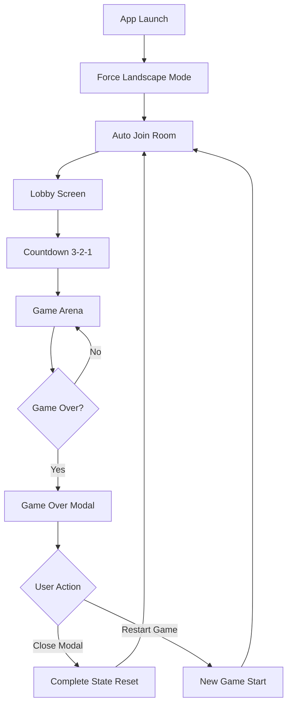

# Worm Zone - Product Requirements Document

## 1. Product Overview

Worm Zone is a real-time multiplayer snake-style game designed for mobile devices in landscape mode. Players compete in shared rooms with up to 3 participants, with AI bots filling empty slots to ensure engaging gameplay.

The game targets mobile users seeking quick, competitive multiplayer experiences with seamless room-based matchmaking and social gameplay features.

## 2. Core Features

### 2.1 User Roles

| Role   | Registration Method | Core Permissions                        |
| ------ | ------------------- | --------------------------------------- |
| Player | MOS SDK integration | Can join rooms, play games, view scores |
| Guest  | Auto-generated ID   | Limited gameplay, no score persistence  |

### 2.2 Feature Module

Our Worm Zone game consists of the following main pages:

1. **Game Arena**: main game canvas, real-time multiplayer gameplay, score display, joypad controls
2. **Room Lobby**: auto room joining, countdown display (3,2,1), player list with bot indicators
3. **Game Over Modal**: score summary, highest score display, restart functionality
4. **Settings Panel**: orientation lock, sound controls, user profile access

### 2.3 Page Details

| Page Name       | Module Name      | Feature Description                                                        |
| --------------- | ---------------- | -------------------------------------------------------------------------- |
| Game Arena      | Game Canvas      | Render worm movement, food collection, collision detection, real-time sync |
| Game Arena      | Joypad Controls  | Touch-based directional controls optimized for landscape mode              |
| Game Arena      | Score Display    | Real-time score updates, leaderboard during gameplay                       |
| Room Lobby      | Auto Matchmaking | Connect players to available rooms, fill with bots if needed               |
| Room Lobby      | Countdown Timer  | Display 3-2-1 countdown before game starts                                 |
| Room Lobby      | Player Status    | Show connected players, bot indicators, connection status                  |
| Game Over Modal | Score Summary    | Display current score, highest score, session statistics                   |
| Game Over Modal | Modal Close      | Close modal and reset all game state (equivalent to SPA hard reload)      |
| Game Over Modal | Restart Controls | Start new game without page reload, rejoin room with zero score            |
| Settings Panel  | Orientation Lock | Force landscape mode, prevent rotation                                     |
| Settings Panel  | User Profile     | MOS SDK integration for user info, login status                            |

## 3. Core Process

**Main Game Flow:**

1. User opens app → Auto-orientation to landscape mode
2. System auto-connects to available room
3. Display lobby with player count and 3-2-1 countdown
4. Game starts with synchronized gameplay
5. On death → Show game over modal with scores
6. Modal Close → Complete state reset (equivalent to app restart)
7. Restart → New game with zero score and rejoin room



## 4. User Interface Design

### 4.1 Design Style

* **Primary Colors**: Vibrant green (#00FF88) for worms, dark blue (#1a1a2e) for background

* **Secondary Colors**: Orange (#FF6B35) for food, red (#FF0000) for danger/collision

* **Button Style**: Rounded corners with 8px radius, gradient backgrounds

* **Font**: Roboto Bold for scores, Roboto Regular for UI text (16px-24px)

* **Layout Style**: Full-screen landscape with floating UI elements

* **Icons**: Minimalist line icons, gaming-themed emojis (🐍, 🎮, 🏆)

### 4.2 Page Design Overview

| Page Name       | Module Name | UI Elements                                                                    |
| --------------- | ----------- | ------------------------------------------------------------------------------ |
| Game Arena      | Game Canvas | Full-screen dark background, neon-style worm trails, particle effects for food |
| Game Arena      | Joypad      | Semi-transparent circular pad, bottom-right corner, haptic feedback            |
| Game Arena      | Score HUD   | Top-left floating panel, real-time score updates, mini leaderboard             |
| Room Lobby      | Player List | Card-based layout, player avatars, bot indicators with robot icons             |
| Room Lobby      | Countdown   | Large centered numbers with pulsing animation, countdown sound effects         |
| Game Over Modal | Score Panel | Centered modal with blur background, trophy icons, animated score counting     |
| Settings Panel  | Controls    | Slide-in panel from right, toggle switches, profile integration                |

### 4.3 Responsiveness

**Landscape-Only Design**: The entire application is optimized exclusively for landscape orientation on mobile devices. Orientation lock is enforced at the application level to prevent rotation to portrait mode.

## 5. Technical Architecture

### 5.1 Technology Stack

* **Frontend**: React 18 + TypeScript + Vite

* **State Management**: Zustand for game state and UI state

* **Real-time Communication**: Socket.io client

* **Mobile Integration**: MOS SDK for mini-program features

* **Backend**: Node.js + Express + Socket.io server

### 5.2 Development Flow

#### 5.2.1 Environment Setup

```bash
# Development command (watches both client and server)
npm run dev

# Port management (if needed)
npx kill-port 3000 5000
```

#### 5.2.2 Code Organization Principles

**DRY Implementation:**

* Shared types between client/server in `/shared/types`

* Reusable game logic in `/shared/game-engine`

* Common utilities in `/shared/utils`

* Socket event definitions in `/shared/events`

**File Structure:**

```
/client
  /src
    /components     # Reusable UI components
    /game          # Game-specific logic
    /hooks         # Custom React hooks
    /stores        # Zustand stores
    /services      # API and socket services
    /utils         # Client utilities
/server
  /src
    /controllers   # Route handlers
    /services      # Business logic
    /socket        # Socket.io handlers
    /utils         # Server utilities
/shared           # Common code between client/server
  /types          # TypeScript definitions
  /game-engine    # Core game logic
  /events         # Socket event definitions
  /utils          # Shared utilities
```

#### 5.2.3 Development Guidelines

1. **Orientation Enforcement**: Implement CSS and JavaScript locks for landscape mode
2. **Socket Synchronization**: Use Zustand middleware for socket state sync
3. **Game State Management**: Centralized game state with predictable updates
4. **Error Handling**: Graceful degradation for connection issues
5. **Performance**: 60fps gameplay with optimized rendering

#### 5.2.4 Testing Strategy

* **Unit Tests**: Game logic, utilities, and pure functions

* **Integration Tests**: Socket communication and state synchronization

* **Mobile Testing**: Landscape orientation and touch controls

* **Multiplayer Testing**: Room management and real-time sync

### 5.3 Deployment

* **Development**: Local development with hot reload

* **Production**: Optimized builds with environment-specific configs

* **Mobile**: MOS SDK integration for mini-program deployment

## 6. API Documentation

### 6.1 Socket Events

#### Client to Server Events

| Event Name | Parameters | Description |
|------------|------------|-------------|
| `playerMove` | `{ playerId: string, angle: number, x: number, y: number, points: Array }` | Updates player position and movement data |
| `foodEaten` | `{ playerId: string, foodId: number }` | Notifies server when player consumes food |
| `deadPointEaten` | `{ playerId: string, deadPoints: Array }` | Notifies server when player consumes dead points |
| `playerDied` | `{ playerId: string, deadPoints: Array }` | Notifies server when player dies and provides body points |
| `requestMinimumPlayers` | `{ minPlayers: number }` | Requests server to spawn bots to reach minimum player count |

#### Server to Client Events

| Event Name | Data Structure | Description |
|------------|----------------|-------------|
| `gameInit` | `{ playerId: string, gameState: GameState }` | Initial game state sent to new player |
| `playerJoined` | `Player` | Broadcasts new player joining to existing players |
| `playerMoved` | `{ playerId: string, x: number, y: number, angle: number, points: Array }` | Broadcasts player movement to other players |
| `playerDied` | `{ playerId: string, deadPoints: Array }` | Broadcasts player death and resulting dead points |
| `playerRespawned` | `Player` | Broadcasts player respawn after death |
| `playerDisconnected` | `string` | Broadcasts player ID when they disconnect |
| `playerLeft` | `{ playerId: string }` | Broadcasts when player leaves the game |
| `foodRegenerated` | `Food` | Broadcasts food regeneration after consumption |
| `deadPointsRemoved` | `{ deadPoints: Array }` | Broadcasts removal of consumed dead points |
| `scoreUpdate` | `{ playerId: string, score: number }` | Broadcasts score updates |
| `leaderboardUpdate` | `{ leaderboard: Array }` | Broadcasts updated leaderboard |
| `gameStats` | `{ playerCount: number, foodCount: number, leaderboard?: Array }` | Periodic game statistics |

### 6.2 Game State Management

#### Game State Structure
```typescript
interface GameState {
  players: Map<string, Player>;
  foods: Food[];
  deadPoints: DeadPoint[];
  maxFoods: number;
  worldWidth: number;
  worldHeight: number;
}

interface Player {
  id: string;
  socketId: string | null;
  x: number;
  y: number;
  points: Point[];
  angle: number;
  radius: number;
  speed: number;
  color: string;
  score: number;
  alive: boolean;
  isBot?: boolean;
}

interface Food {
  id: number;
  x: number;
  y: number;
  radius: number;
  color: string;
}

interface DeadPoint {
  x: number;
  y: number;
  radius: number;
  color: string;
}
```

#### Bot Management
- Maximum 20 bots allowed simultaneously
- Bots spawn automatically when first human player joins
- Bots are removed permanently when they die
- Bot AI includes collision detection, food consumption, and boundary checking

#### Game Mechanics
- World size: 2000x2000 pixels
- Maximum 1000 food items
- Dead points cleanup when exceeding 5000 items
- Human players respawn after 3 seconds, bots are permanently removed
- Score system: 1 point per food, 1 point per dead point consumed

### 6.3 Server Configuration

#### Server Setup
- **Port**: 9000 (configurable via PORT environment variable)
- **CORS**: Enabled for all origins
- **Socket.io**: Real-time communication with automatic reconnection
- **Static Files**: Disabled (client served separately)

#### Update Intervals
- Bot movement updates: 100ms
- Game statistics broadcast: 5000ms
- Leaderboard updates: 1000ms
- Dead points cleanup: 30000ms

#### Performance Optimizations
- Efficient collision detection using distance calculations
- Batch processing of dead points
- Periodic cleanup of game objects
- Optimized leaderboard generation with sorting and filtering

## 7. Game Over Modal State Management

### 7.1 Modal Close Functionality

**Requirement**: When user closes the Game Over modal (via close button, ESC key, or clicking outside), the application should perform a complete state reset equivalent to a hard page reload but within the SPA context.

**Implementation Details**:
- Reset all Zustand store state to initial values (except persistent data like highest score)
- Clear all game objects (snakes, food, dead points)
- Disconnect from current multiplayer room
- Reset socket connection state
- Clear any running timers or intervals
- Reset canvas and UI components to initial state
- Return to initial app state (ready to join new room)

**State Reset Scope**:
```typescript
// Complete state reset includes:
- Game state (isPlaying, isGameOver, score, rank)
- Game objects (mySnake, otherSnakes, foods, deadPoints)
- Room state (currentPlayerId, leaderboard, playerCount)
- UI state (controls, countdown, status)
- Socket state (disconnect and prepare for new connection)
// Preserve only:
- Persistent stats (highestScore)
- User preferences and settings
```

### 7.2 Restart Game Functionality

**Requirement**: When user clicks "Restart" or "Play Again" button, start a new game session without page reload while maintaining the current room context if possible.

**Implementation Details**:
- Reset game-specific state (score, rank, game objects)
- Preserve room connection and player context
- Rejoin the same room or find new room if current is full
- Start new game countdown (3-2-1)
- Initialize fresh game objects and canvas
- Maintain socket connection for seamless transition

**State Reset Scope**:
```typescript
// Restart game reset includes:
- Game state (score: 0, rank: 0, isGameOver: false)
- Game objects (reset snakes, foods, dead points)
- Game status (return to countdown/lobby state)
// Preserve:
- Room connection and player ID
- Socket connection
- Leaderboard context
- User session and preferences
- Highest score and statistics
```

### 7.3 User Interface Requirements

**Modal Controls**:
- **Close Button (×)**: Triggers complete state reset
- **ESC Key**: Triggers complete state reset
- **Click Outside Modal**: Triggers complete state reset
- **Play Again Button**: Triggers restart game functionality
- **Spacebar**: Triggers restart game functionality (existing)

**Visual Feedback**:
- Loading states during state transitions
- Clear distinction between close and restart actions
- Confirmation dialogs for destructive actions (optional)

### 7.4 Technical Implementation

**Zustand Store Actions**:
```typescript
// New store actions required:
resetCompleteState: () => void;  // For modal close
restartGame: () => void;          // For play again
cleanupGameSession: () => void;   // Cleanup utilities
```

**Socket Event Handling**:
- Proper cleanup of socket listeners on complete reset
- Graceful room leaving on modal close
- Room rejoin logic for restart functionality

**Component Lifecycle**:
- Proper cleanup of React components and effects
- Canvas context reset and reinitialization
- Timer and interval cleanup

## 8. Implementation Priorities

### Phase 1: Core Infrastructure

* [ ] Landscape orientation lock implementation

* [ ] Socket.io client/server setup

* [ ] Basic game canvas and rendering

* [ ] Zustand store architecture

### Phase 2: Game Mechanics

* [ ] Worm movement and collision detection

* [ ] Food generation and consumption

* [ ] Score calculation and display

* [ ] Game over detection

### Phase 3: Multiplayer Features

* [ ] Room management system

* [ ] Auto-matchmaking with bots

* [ ] Real-time state synchronization

* [ ] Player connection handling

### Phase 4: UI/UX Polish

* [ ] Joypad controls optimization

* [ ] Game over modal with animations

* [ ] Lobby countdown and player display

* [ ] Settings panel and profile integration

## 9. Success Metrics

* **Performance**: Maintain 60fps during gameplay

* **Connectivity**: <100ms latency for real-time sync

* **User Experience**: Seamless landscape-only operation

* **Engagement**: Average session duration >5 minutes

* **Stability**: <1% crash rate during gameplay

