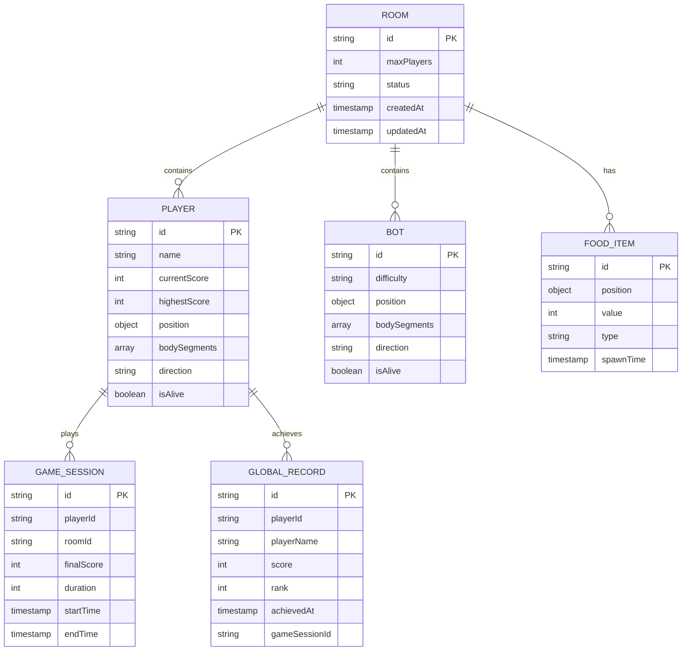

# Snake Zone - Technical Architecture Document

## 1. Architecture Design


## 2. Technology Description

* **Frontend**: React\@18 + TypeScript + Vite + Zustand + Socket.io-client

* **Backend**: Node.js + Express\@4 + Socket.io

* **Mobile Integration**: MOS SDK for mini-program features

* **Development**: Concurrent dev server for client/server

## 3. Route Definitions

| Route     | Purpose                                               |
| --------- | ----------------------------------------------------- |
| /         | Main game interface with forced landscape orientation |
| /game     | Game arena with real-time multiplayer canvas          |
| /lobby    | Room joining and countdown display                    |
| /settings | User preferences and profile management               |

## 4. API Definitions

### 4.1 Socket Events

**Room Management**

```typescript
// Client to Server
interface JoinRoomEvent {
  playerId: string;
  playerName: string;
}

// Server to Client
interface RoomJoinedEvent {
  roomId: string;
  players: Player[];
  bots: Bot[];
  countdown: number;
}
```

**Game State Synchronization**

```typescript
// Bidirectional
interface GameStateEvent {
  roomId: string;
  players: PlayerState[];
  food: FoodItem[];
  timestamp: number;
}

interface PlayerMoveEvent {
  playerId: string;
  direction: 'up' | 'down' | 'left' | 'right';
  position: { x: number; y: number };
}
```

**Game Events**

```typescript
interface GameOverEvent {
  playerId: string;
  finalScore: number;
  highestScore: number;
  rank: number;
}

interface RestartGameEvent {
  playerId: string;
  resetScore: boolean;
  roomId?: string;
}

interface CompleteResetEvent {
  playerId: string;
  leaveRoom: boolean;
}

interface ModalCloseEvent {
  playerId: string;
  action: 'close' | 'restart';
}

interface GlobalLeaderboardEvent {
  leaderboard: GlobalRecord[];
  currentUserRank?: number;
  totalPlayers: number;
}

interface NewRecordEvent {
  playerId: string;
  playerName: string;
  score: number;
  newRank: number;
  isPersonalBest: boolean;
}
```

### 4.2 REST API Endpoints

**Health Check**

```
GET /api/health
```

Response:

```json
{
  "status": "ok",
  "timestamp": "2024-01-01T00:00:00Z"
}
```

**Player Statistics**

```
GET /api/player/:id/stats
```

Response:

```json
{
  "playerId": "player123",
  "gamesPlayed": 45,
  "highestScore": 1250,
  "averageScore": 680
}
```

**Global Leaderboard**

```
GET /api/leaderboard/global
```

Response:

```json
{
  "leaderboard": [
    {
      "rank": 1,
      "playerId": "player456",
      "playerName": "SnakeKing",
      "score": 2500,
      "achievedAt": "2024-01-01T12:00:00Z"
    }
  ],
  "currentUserRank": 5,
  "totalPlayers": 1250
}
```

**Submit Score**

```
POST /api/player/:id/score
```

Request:

```json
{
  "score": 1500,
  "gameSession": "session123"
}
```

Response:

```json
{
  "newPersonalBest": true,
  "globalRank": 8,
  "qualifiesForLeaderboard": true
}
```

## 5. Server Architecture Diagram


## 6. Data Model

### 6.1 Data Model Definition



### 6.2 Data Definition Language

**In-Memory Data Structures (No Database Required)**

```typescript
// Room Management
interface Room {
  id: string;
  players: Map<string, Player>;
  bots: Map<string, Bot>;
  food: Map<string, FoodItem>;
  gameState: 'waiting' | 'countdown' | 'playing' | 'finished';
  countdown: number;
  createdAt: Date;
}

// Player State
interface Player {
  id: string;
  name: string;
  socketId: string;
  position: { x: number; y: number };
  bodySegments: Array<{ x: number; y: number }>;
  direction: Direction;
  score: number;
  isAlive: boolean;
  lastUpdate: number;
}

// Bot AI State
interface Bot {
  id: string;
  difficulty: 'easy' | 'medium' | 'hard';
  position: { x: number; y: number };
  bodySegments: Array<{ x: number; y: number }>;
  direction: Direction;
  score: number;
  isAlive: boolean;
  aiState: {
    target: { x: number; y: number } | null;
    pathfinding: Array<{ x: number; y: number }>;
    lastDecision: number;
  };
}

// Game Objects
interface FoodItem {
  id: string;
  position: { x: number; y: number };
  value: number;
  type: 'apple' | 'cherry' | 'donut' | 'burger' | 'pizza';
  spawnTime: number;
  color: string;
}

interface DeadPoint {
  x: number;
  y: number;
  radius: number;
  color: string;
  type?: 'apple' | 'cherry' | 'donut' | 'burger' | 'pizza';
  createdAt: number;
}

type Direction = 'up' | 'down' | 'left' | 'right';

// Global Leaderboard
interface GlobalRecord {
  id: string;
  playerId: string;
  playerName: string;
  score: number;
  rank: number;
  achievedAt: Date;
  gameSessionId: string;
}

interface GlobalLeaderboard {
  records: GlobalRecord[];
  currentUserRank?: number;
  totalPlayers: number;
  lastUpdated: Date;
}

// Game Configuration
const GAME_CONFIG = {
  CANVAS_WIDTH: 800,
  CANVAS_HEIGHT: 600,
  GRID_SIZE: 20,
  MAX_PLAYERS_PER_ROOM: 3,
  BOT_FILL_THRESHOLD: 3,
  FOOD_SPAWN_RATE: 2000, // ms
  GAME_TICK_RATE: 60, // fps
  COUNTDOWN_DURATION: 3000, // ms
  GLOBAL_LEADERBOARD_SIZE: 10, // top 10 records
  FOOD_TYPES: ['apple', 'cherry', 'donut', 'burger', 'pizza'] as const,
  DEAD_POINT_CLEANUP_INTERVAL: 30000 // 30 seconds
};

### 6.3 Food Type Preservation System Architecture

**System Overview**: The food type preservation system ensures consistent food type display throughout the entire game lifecycle, from initial food spawning to final dead food consumption.

**Client-Side Implementation**:

```typescript
// Point class with type support
class Point {
  x: number;
  y: number;
  radius: number;
  color: string;
  type?: 'apple' | 'cherry' | 'donut' | 'burger' | 'pizza';
  
  static create(x: number, y: number, radius: number, color: string, type?: string): Point {
    const point = new Point(x, y, radius, color);
    if (type) point.type = type as any;
    return point;
  }
}

// Snake class with type preservation
class Snake {
  eat(type?: string): void {
    // Preserve food type in new segment
    const newPoint = Point.create(
      this.points[0].x,
      this.points[0].y,
      this.radius,
      this.color,
      type
    );
    this.points.unshift(newPoint);
  }
  
  over(): void {
    // Convert segments to food with preserved types
    this.points.forEach(p => {
      const food = new Food(
        p.x, p.y, p.radius,
        p.type || 'pizza' // Fallback only when type is genuinely missing
      );
      store.foods.push(food);
    });
  }
}
```

**Server-Side Implementation**:

```typescript
// Food type to color mapping
function getFoodColorByType(type: string): string {
  const colorMap = {
    'apple': '#FF0000',    // Red
    'cherry': '#DC143C',   // Dark red
    'donut': '#DDA0DD',    // Plum
    'burger': '#8B4513',   // Saddle brown
    'pizza': '#FF8C00'     // Dark orange
  };
  return colorMap[type] || colorMap['pizza'];
}

// Bot death handler with type preservation
function handleBotDeath(bot) {
  bot.points.forEach(point => {
    const foodType = point.type || 'pizza';
    const newFood = {
      id: generateFoodId(),
      x: point.x,
      y: point.y,
      radius: point.radius,
      type: foodType,
      color: getFoodColorByType(foodType)
    };
    gameState.foods.push(newFood);
  });
}

// Player death handler with type preservation
socket.on('playerDied', (data) => {
  data.deadPoints.forEach(point => {
    const foodType = point.type || 'pizza';
    const newFood = {
      id: generateFoodId(),
      x: point.x,
      y: point.y,
      radius: point.radius,
      type: foodType,
      color: getFoodColorByType(foodType)
    };
    gameState.foods.push(newFood);
  });
});
```

**Cross-Platform Synchronization**:

1. **Unified Type System**: Both client and server use identical food type definitions
2. **Consistent Color Mapping**: Same color-to-type mapping functions on both sides
3. **Type Validation**: Proper fallback mechanisms when type data is missing
4. **Socket Event Sync**: Food type information included in all relevant socket events
5. **Dead Point Lifecycle**: Type preservation throughout the 30-second cleanup cycle

**Performance Considerations**:

- Type information adds minimal memory overhead (string reference)
- Color mapping functions are optimized with lookup tables
- Type validation occurs only during food creation/conversion
- No impact on collision detection or movement calculations
```

## 7. Landscape Orientation Implementation

### 7.1 CSS Orientation Lock

```css
/* Force landscape orientation */
@media screen and (orientation: portrait) {
  .app-container {
    transform: rotate(90deg);
    transform-origin: center;
    width: 100vh;
    height: 100vw;
    position: fixed;
    top: 0;
    left: 0;
  }
}

/* Landscape-optimized layout */
.game-canvas {
  width: 100vw;
  height: 100vh;
  position: fixed;
  top: 0;
  left: 0;
}

.joypad-container {
  position: fixed;
  bottom: 20px;
  right: 20px;
  width: 120px;
  height: 120px;
}
```

### 7.2 Modal Scrollability for Landscape Mode

```css
/* Enhanced modal scrollability */
.modal-content {
  max-height: calc(85vh - 100px);
  overflow-y: auto;
  scrollbar-width: thin;
  scrollbar-color: rgba(76, 175, 80, 0.5) transparent;
}

.modal-content::-webkit-scrollbar {
  width: 6px;
}

.modal-content::-webkit-scrollbar-track {
  background: transparent;
}

.modal-content::-webkit-scrollbar-thumb {
  background: rgba(76, 175, 80, 0.3);
  border-radius: 3px;
  transition: background 0.3s ease;
}

.modal-content::-webkit-scrollbar-thumb:hover {
  background: rgba(76, 175, 80, 0.5);
}

/* Global leaderboard specific styling */
.global-leaderboard {
  max-height: 300px;
  overflow-y: auto;
  margin: 20px 0;
}

.leaderboard-entry {
  display: flex;
  justify-content: space-between;
  align-items: center;
  padding: 12px;
  border-bottom: 1px solid rgba(76, 175, 80, 0.2);
}

.leaderboard-entry.current-user {
  background: rgba(76, 175, 80, 0.1);
  border: 1px solid rgba(76, 175, 80, 0.3);
  border-radius: 8px;
}

.rank-crown {
  color: #FFD700;
  font-size: 18px;
}
```

### 7.3 JavaScript Orientation Control

```typescript
// Orientation lock utility
export const enforceOrientation = () => {
  // Lock screen orientation if supported
  if (screen.orientation && screen.orientation.lock) {
    screen.orientation.lock('landscape').catch(console.warn);
  }
  
  // Fallback: CSS transform for portrait mode
  const handleOrientationChange = () => {
    const isPortrait = window.innerHeight > window.innerWidth;
    document.body.classList.toggle('force-landscape', isPortrait);
  };
  
  window.addEventListener('orientationchange', handleOrientationChange);
  window.addEventListener('resize', handleOrientationChange);
  
  // Initial check
  handleOrientationChange();
};
```

## 8. Performance Optimization

### 8.1 Client-Side Optimization

* **Canvas Rendering**: Use requestAnimationFrame for smooth 60fps

* **State Updates**: Debounced Zustand updates to prevent excessive re-renders

* **Socket Throttling**: Limit movement updates to 30fps to reduce network load

* **Memory Management**: Object pooling for game entities

### 8.2 Server-Side Optimization

* **Game Loop**: Fixed timestep game loop at 60fps

* **Spatial Partitioning**: Grid-based collision detection

* **Bot AI**: Efficient pathfinding with A\* algorithm

* **Room Cleanup**: Automatic room disposal when empty

## 9. Game Over Modal State Management

### 9.1 Complete State Reset Implementation

**Zustand Store Extensions**:

```typescript
interface GameStore extends GameState {
  // Existing properties...
  
  // New actions for modal management
  resetCompleteState: () => void;
  restartGame: () => void;
  cleanupGameSession: () => void;
  handleModalClose: (action: 'close' | 'restart') => void;
}

// Implementation
resetCompleteState: () => set((state) => ({
  ...initialState,
  // Preserve only persistent data
  highestScore: state.highestScore,
  // Reset everything else including socket state
})),

restartGame: () => set((state) => ({
  ...state,
  // Reset game-specific state only
  isPlaying: false,
  isGameOver: false,
  score: 0,
  rank: 0,
  mySnake: null,
  otherSnakes: [],
  foods: [],
  deadPoints: [],
  status: 'Ready'
})),

cleanupGameSession: () => {
  // Clear timers, intervals, and event listeners
  // Reset canvas context
  // Cleanup socket listeners
},

handleModalClose: (action) => {
  if (action === 'close') {
    get().resetCompleteState();
    get().cleanupGameSession();
    // Emit socket event to leave room
    socketClient.emit('leaveRoom', { playerId: get().currentPlayerId });
  } else if (action === 'restart') {
    get().restartGame();
    // Emit socket event to restart in same room
    socketClient.emit('restartGame', { 
      playerId: get().currentPlayerId,
      resetScore: true 
    });
  }
}
```

### 9.2 Socket Event Handling

**Client-Side Socket Management**:

```typescript
// Socket cleanup for complete reset
const handleCompleteReset = () => {
  // Remove all existing listeners
  socketClient.off('gameState');
  socketClient.off('playerJoined');
  socketClient.off('playerLeft');
  socketClient.off('gameOver');
  socketClient.off('globalLeaderboard');
  socketClient.off('newRecord');
  
  // Disconnect from current room
  socketClient.emit('leaveRoom', {
    playerId: useGameStore.getState().currentPlayerId,
    leaveRoom: true
  });
  
  // Reset connection state
  socketClient.disconnect();
  
  // Prepare for new connection
  setTimeout(() => {
    socketClient.connect();
  }, 100);
};

// Global leaderboard socket handlers
const setupGlobalLeaderboardListeners = () => {
  socketClient.on('globalLeaderboard', (data: GlobalLeaderboardEvent) => {
    useGameStore.getState().updateGlobalLeaderboard(data.leaderboard, data.currentUserRank);
  });
  
  socketClient.on('newRecord', (data: NewRecordEvent) => {
    if (data.isPersonalBest) {
      useGameStore.getState().updateHighestScore(data.score);
    }
    // Show celebration animation for new records
    if (data.playerId === useGameStore.getState().currentPlayerId) {
      useGameStore.getState().setNewRecordAchieved(true, data.newRank);
    }
  });
};

// Socket management for restart
const handleGameRestart = () => {
  // Keep existing connection and listeners
  // Just reset game state and rejoin room
  socketClient.emit('restartGame', {
    playerId: useGameStore.getState().currentPlayerId,
    resetScore: true,
    roomId: useGameStore.getState().currentRoomId
  });
};
```

**Server-Side Event Handlers**:

```javascript
// Handle complete reset (leave room)
socket.on('leaveRoom', (data) => {
  const { playerId, leaveRoom } = data;
  
  if (leaveRoom) {
    // Remove player from current room
    const room = findPlayerRoom(playerId);
    if (room) {
      removePlayerFromRoom(room.id, playerId);
      socket.leave(room.id);
      
      // Notify other players
      socket.to(room.id).emit('playerLeft', {
        playerId,
        reason: 'reset'
      });
    }
  }
});

// Handle game restart
socket.on('restartGame', (data) => {
  const { playerId, resetScore, roomId } = data;
  
  // Reset player state but keep in room
  const player = getPlayer(playerId);
  if (player) {
    player.score = 0;
    player.rank = 0;
    player.isAlive = true;
    player.position = getRandomStartPosition();
    
    // If room specified and available, rejoin
    if (roomId && isRoomAvailable(roomId)) {
      socket.join(roomId);
    } else {
      // Find new room or create one
      const newRoom = findOrCreateRoom();
      socket.join(newRoom.id);
    }
    
    // Start new game countdown
    startGameCountdown(socket);
  }
});
```

### 9.3 Component Implementation

**Enhanced GameOverModal Component**:

```typescript
export const GameOverModal: React.FC<GameOverModalProps> = ({ onRestart }) => {
  const { handleModalClose } = useGameStore();
  
  // Handle modal close (complete reset)
  const handleClose = useCallback(() => {
    handleModalClose('close');
  }, [handleModalClose]);
  
  // Handle restart (new game)
  const handleRestart = useCallback(() => {
    handleModalClose('restart');
    onRestart();
  }, [handleModalClose, onRestart]);
  
  // ESC key and click outside handlers
  useEffect(() => {
    const handleKeyDown = (e: KeyboardEvent) => {
      if (e.key === 'Escape') {
        handleClose();
      }
    };
    
    const handleClickOutside = (e: MouseEvent) => {
      const modal = document.querySelector('.game-over-modal');
      if (modal && !modal.contains(e.target as Node)) {
        handleClose();
      }
    };
    
    document.addEventListener('keydown', handleKeyDown);
    document.addEventListener('mousedown', handleClickOutside);
    
    return () => {
      document.removeEventListener('keydown', handleKeyDown);
      document.removeEventListener('mousedown', handleClickOutside);
    };
  }, [handleClose]);
  
  return (
    <div className="game-over-modal">
      <div className="modal-content">
        <button className="close-button" onClick={handleClose}>×</button>
        {/* Existing modal content */}
        <button className="restart-button" onClick={handleRestart}>
          Play Again
        </button>
      </div>
    </div>
  );
};
```

### 9.4 Canvas and Game Engine Reset

**Canvas Context Reset**:

```typescript
class GameEngine {
  resetCanvas(): void {
    if (this.canvas && this.ctx) {
      // Clear canvas
      this.ctx.clearRect(0, 0, this.canvas.width, this.canvas.height);
      
      // Reset canvas properties
      this.ctx.globalAlpha = 1;
      this.ctx.globalCompositeOperation = 'source-over';
      
      // Clear any cached drawing operations
      this.ctx.beginPath();
    }
  }
  
  completeReset(): void {
    // Stop animation loop
    this.stop();
    
    // Clear all game objects
    this.aiSnakes = [];
    Snake.deadPoints = [];
    
    // Reset canvas
    this.resetCanvas();
    
    // Clear timers
    this.lastSpawnTime = 0;
    this.lastSocketUpdate = 0;
    
    // Reset game state flags
    this.isInitialized = false;
  }
  
  restartGame(): void {
    // Lighter reset for restart
    this.stop();
    this.aiSnakes = [];
    Snake.deadPoints = [];
    this.resetCanvas();
    this.initializeGame();
  }
}
```

## 10. Development Workflow

### 9.1 DRY Implementation Strategy

```typescript
// Shared types and utilities
// /shared/types/game.ts
export interface GameState {
  players: Player[];
  bots: Bot[];
  food: FoodItem[];
}

// /shared/utils/collision.ts
export const checkCollision = (pos1: Position, pos2: Position): boolean => {
  return pos1.x === pos2.x && pos1.y === pos2.y;
};

// /shared/game-engine/core.ts
export class GameEngine {
  // Shared game logic between client and server
  updatePlayerPosition(player: Player, direction: Direction): Player {
    // Implementation shared by both client prediction and server authority
  }
}
```

### 9.2 Development Commands

```bash
# Start development environment
npm run dev

# Build for production
npm run build

# Run tests
npm test

# Port management
npx kill-port 3000 5000

# Type checking
npm run type-check
```

### 9.3 Code Quality Standards

* **TypeScript**: Strict mode enabled, no implicit any

* **ESLint**: Airbnb configuration with React hooks rules

* **Prettier**: Consistent code formatting

* **Husky**: Pre-commit hooks for linting and testing

* **Testing**: Jest for unit tests, Playwright for E2E testing

